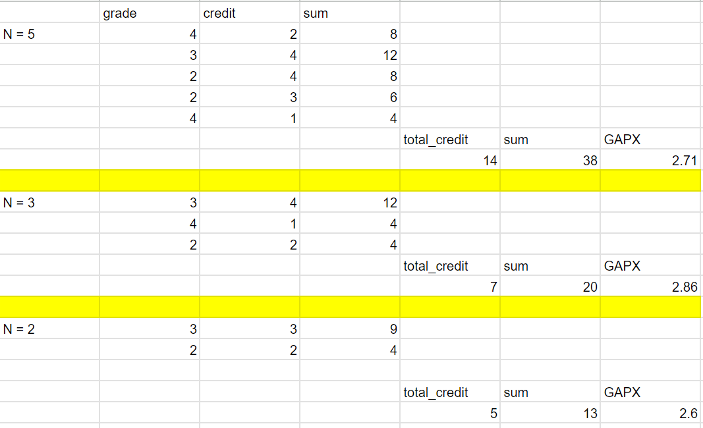

WEEK#10 Algorithm  Loop-GPAX แบบ for loop

โปรเจกต์นี้ประกอบไปด้วยไฟล์ต่าง ๆ ที่เกี่ยวข้องกับการเขียนโปรแกรมและเอกสารในสัปดาห์ที่ 10 รายละเอียดของไฟล์แต่ละไฟล์มีดังนี้:

## รายละเอียดไฟล์:

1.   
   **Code.png** - ภาพแสดงโค้ดที่ใช้ในโครงการสัปดาห์ที่ 10
2.   
   **Flowchart.png** - ภาพผังงาน (Flowchart) ของโค้ดในสัปดาห์ที่ 10
3.   
   **Pseudocode.png** - ภาพแสดงรหัสเทียม
5.   
   **Trace_Table.png** - ภาพแสดงตารางลำดับการทำงานของโปรแกรม

## วิธีการใช้งาน:

1. เพื่อดูลำดับการทำงานของโปรแกรม สามารถดูได้จากไฟล์ **Flowchart.png**
2. ไฟล์ **Pseudocode.txt** และ **Pseudocode.png** จะแสดงรหัสเทียม (Pseudocode) ที่อธิบายการทำงานของโปรแกรม
3. ไฟล์ **week_10.cpp** เป็นซอร์สโค้ด C++ ที่คุณสามารถนำไปคอมไพล์และรันเพื่อดูผลลัพธ์
4. ไฟล์ **Trace_Table.png** แสดงตารางการเปลี่ยนแปลงของตัวแปรทีละขั้นตอนในโปรแกรม
5. สำหรับรายละเอียดเพิ่มเติมและสรุปงาน สามารถดูได้จากไฟล์ **WEEK_10.pdf**
